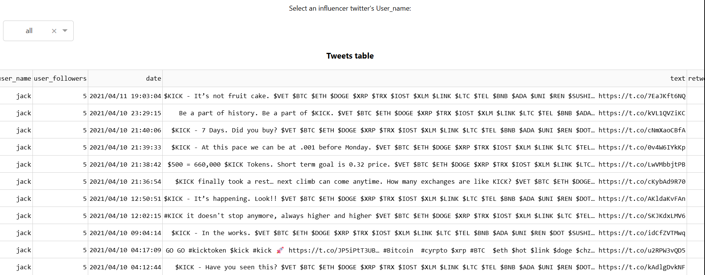
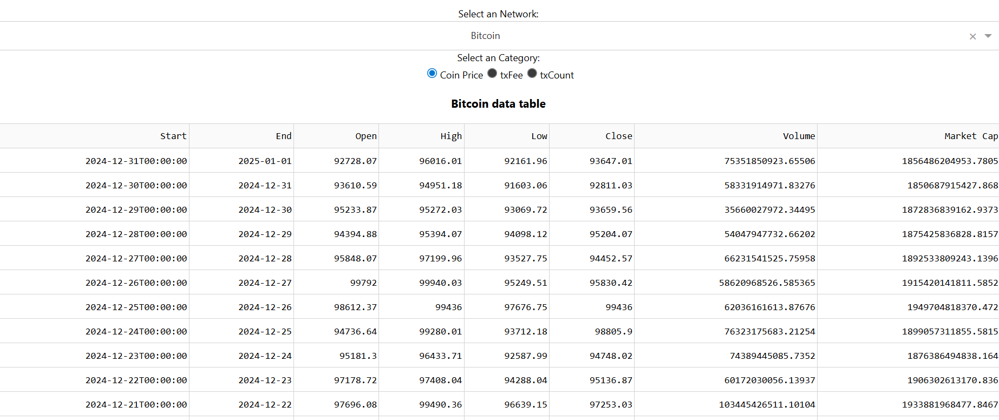
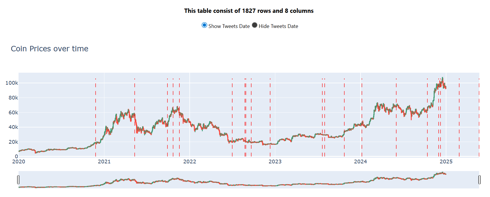

# Project Overview

This project explores the relationship between influencer activity on Twitter and blockchain network metrics such as coin price, transaction fee, and transaction count.

## 1. Tweets Data

Filter a specific influencer account and analyze their tweets.

## 2. Blockchain Data

Filter a blockchain network and analyze the related metrics, such as coin price, transaction fee, and transaction count. The available metrics may vary by network.

## 3. Analysis

Compare how the selected network and coin metrics change before and after a tweet is posted by the chosen influencer.

